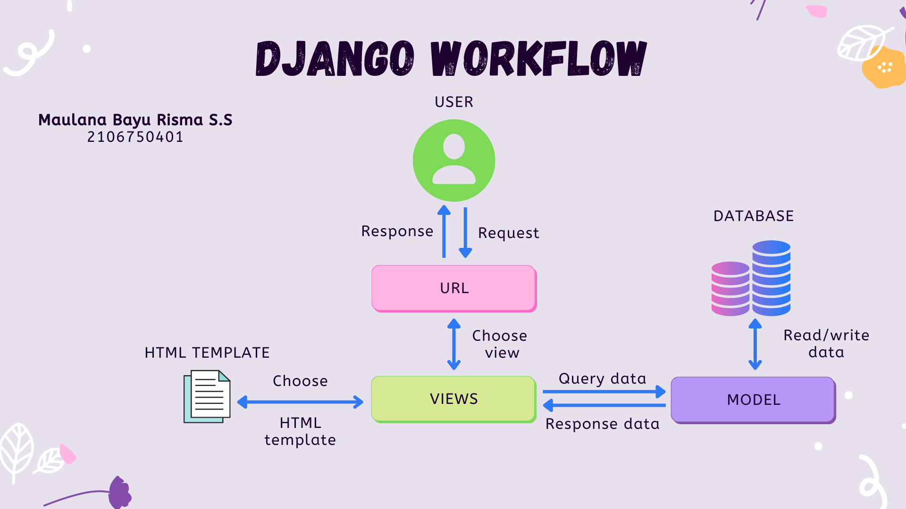

# Tugas 2 PBP 22/23 Repository

Berikut adalah link hasil web yang telah di-deploy [Tugas 2 Web](https://tugas-2-project.herokuapp.com/katalog)

Ketika user melakukan sebuah request, request tersebut akan dilanjutkan menuju urls.py. Request akan diarahkan menuju path url yang sesuai, path url tersebut akan melakukan pemanggilan fungsi yang berada di views.py. Di views.py fungsi tersebut akan menampilkan berkas html beserta data-data yang dibutuhkan. Data tersebut diambil dan diolah di models.py kemudian dikirimkan kembali ke views.py. Sehingga halaman web beserta data-data yan sesuai dengan request dapat ditampilkan kembali ke user.

## Virtual Environment

Virtual environment berperan seperti workspace khusus bagi setiap project yang ingin kita kerjakan. Hal ini berguna ketika kita membutuhkan dependencies yang berbeda-beda untuk setiap project kita. Dengan demikian, virtual environment dipakai sehingga kita tidak perlu mengubah configuration di sistem operasi kita setiap ingin memulai project baru. Kita tetap dapat membuat Django web app tanpa virtual environment, tetapi modul yang kita pakai akan diinstall secara global dan dapat berpotensi menimbulkan masalah kompalibitas saat kita ingin membangun web app lainnya.

## Implementasi poin 1-4

1. Hal yang pertama dilakukan adalah mengimport class CatalogItem dari models.py. CatalogItem ini merupakan model database yang nantinya akan dirender. Seluruh properti di dalamnya akan dimasukkan ke dalam variabel data_catalog_item. Setelah itu saya membuat variable berisi nama dan NPM, kedua variabel tersebut bersama dengan data_catalog_item dimasukkan ke dalam object dictionary context. Kemudian fungsi show_catalog didefinisikan yang akan merender file katalog.html beserta context untuk menampilkan halaman web beserta data yang sesuai.

2. Untuk routing, pertama adalah melakukan import fungsi show_catalog yang telah dibuat di views.py. Kemudian saya membuat urlpatterns berisi path url yang akan dihubungkan dengan pemanggilan fungsi show_catalog tersebut.

3. Setiap data dari data_catalog_item yang dikirimkan melalui context di views.py akan diiterasi dengan for loop untuk membentuk sebuah tabel. Selain itu, saya juga menambahkan sedikit styling untuk tabelnya di base.html.

4. Setelah melakukan push ke dalam repo github, saya memeriksa kelengkapan file Procfile, dpl.yml, dan gitignore untuk melakukan deploy. Deploy dilakukan dengan menghubungkan API code dari Heroku melalui variabel yang disediakn di fitur repository secrets oleh github. Setelah terhubung, deploy dapat dilakukan dengan menjalankan workflow repo github tersebut.
